# Ziggy Web App - Data Flows

This document describes the key data flows through the application: how data moves from the backend to the UI, how auth and permissions work, and how realtime updates propagate.

---

## 1. Authentication & Authorization Flow

### Overview

Authentication is handled by Supabase Auth, with an optimized provider that minimizes unnecessary queries for anonymous users and computes admin scope (global vs scoped admin access).

### Sequence Diagram

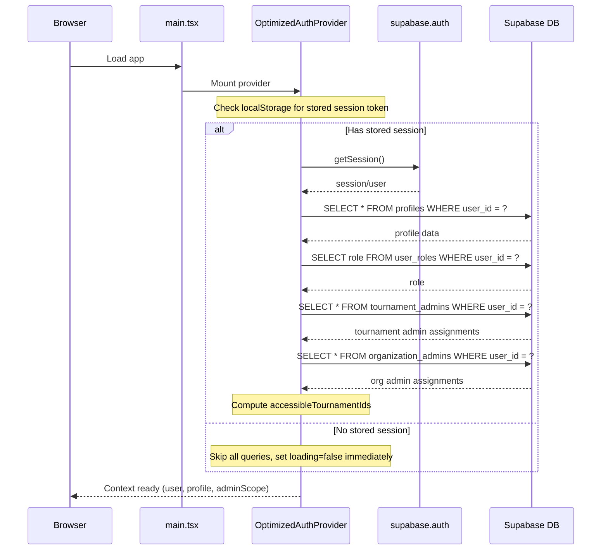

### Key Data Structures

```typescript
// Profile returned from auth context
interface Profile {
  id: string;
  user_id: string;
  role: 'user' | 'admin' | 'judge' | 'observer' | 'participant';
  first_name?: string;
  last_name?: string;
  // ...
}

// Admin scope computed by auth provider
interface AdminScope {
  tournamentAdmins: TournamentAdminAssignment[];  // Direct tournament access
  organizationAdmins: OrganizationAdminAssignment[];  // Org-level access
  accessibleTournamentIds: string[];  // Combined list of all accessible tournaments
}

// Context exposed to consumers
interface AuthContextType {
  user: User | null;
  session: Session | null;
  profile: Profile | null;
  loading: boolean;
  isAdmin: boolean;  // Global admin (role === 'admin')
  adminScope: AdminScope;
  isTournamentAdmin: (tournamentId: string) => boolean;
  isOrgAdmin: (orgId: string) => boolean;
  canAccessTournament: (tournamentId: string) => boolean;
  hasAnyAdminAccess: boolean;
  signUp, signIn, signOut, refreshUser
}
```

### Route Protection

Routes are protected using the `ProtectedRoute` component:

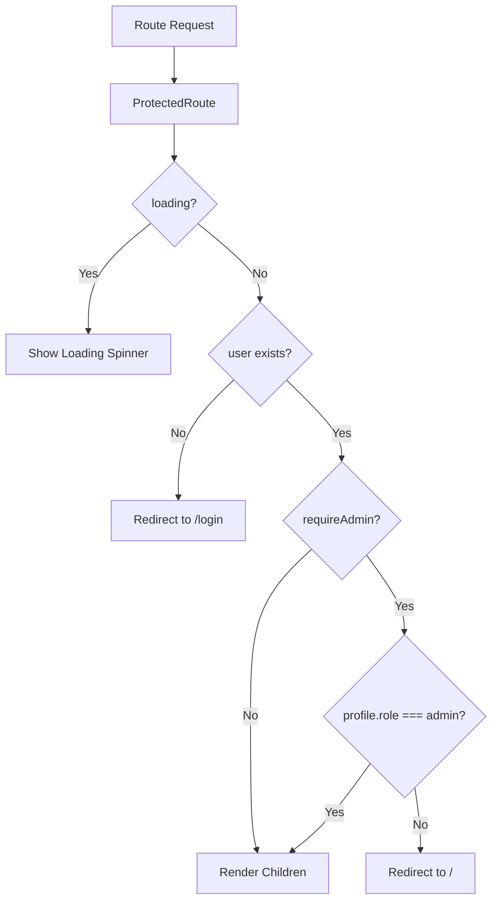

---

## 2. Data Fetching with React Query

### Standard Query Flow

Most data fetching uses React Query for caching and state management:

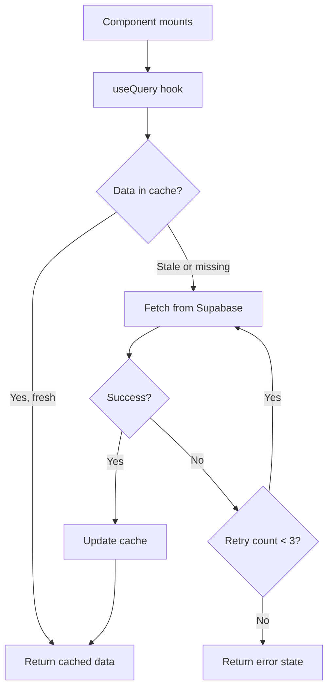

### Query Configuration

Default settings from `QueryProvider.tsx`:

```typescript
const queryClient = new QueryClient({
  defaultOptions: {
    queries: {
      staleTime: 5 * 60 * 1000,  // 5 minutes
      gcTime: 10 * 60 * 1000,    // 10 minutes (garbage collection)
      refetchOnWindowFocus: false,
      refetchOnMount: false,
      refetchOnReconnect: 'always',
      retry: (failureCount, error) => {
        if (error?.status >= 400 && error?.status < 500) return false;
        return failureCount < 3;
      },
    },
  },
});
```

### Example: Tournament Data Hook

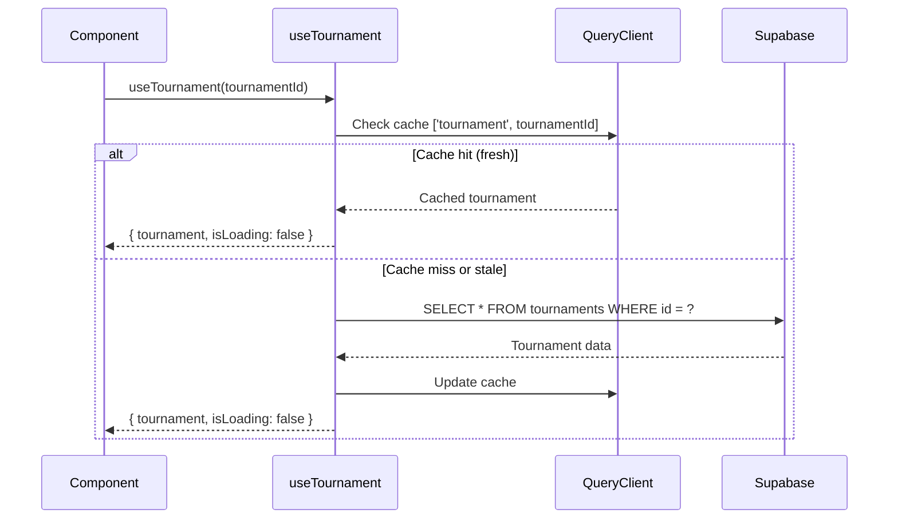

---

## 3. Tournament Participant Flow

### Browse to Registration Journey

```mermaid
flowchart TD
    subgraph Public
        Browse[/tournaments] --> List[Tournament List]
        List --> Landing[/tournaments/:id - Landing Page]
    end
    
    subgraph Registration
        Landing --> Register[/tournaments/:id/register]
        Register --> Form[Registration Form]
        Form --> Payment{Payment Required?}
        Payment -->|Yes| PayFlow[Payment Flow]
        Payment -->|No| Confirm[Confirm Registration]
        PayFlow --> Confirm
    end
    
    subgraph Participant_Dashboard[Participant Dashboard]
        Confirm --> MyTournaments[/my-tournaments]
        MyTournaments --> TournamentDash[/tournaments/:id/dashboard]
        TournamentDash --> MyMatch[/tournaments/:id/my-match]
        TournamentDash --> Postings[/tournaments/:id/postings]
        TournamentDash --> Rounds[/tournaments/:id/rounds]
    end
```

### Registration Data Flow

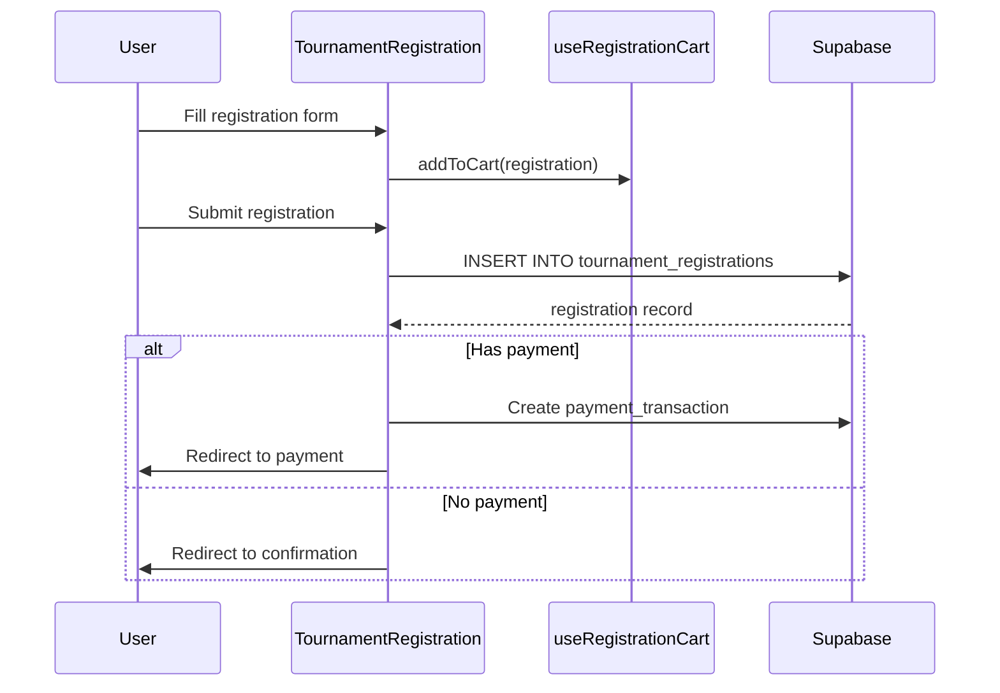

---

## 4. Realtime Updates

### Tournament Realtime Subscription

The `useTournamentRealtime` hook subscribes to multiple database tables:

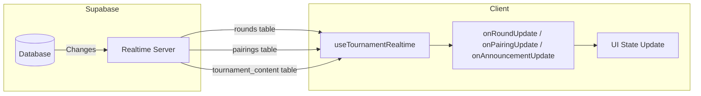

### Subscription Lifecycle

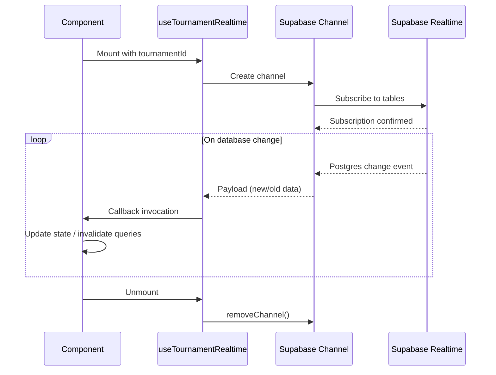

### Pairing-Specific Realtime

For round-specific pairing updates, `usePairingRealtime` provides a focused subscription:

```typescript
// Subscribes to pairings for a specific round
usePairingRealtime({
  roundId: 'abc-123',
  onUpdate: (payload) => { /* handle pairing update */ },
  onInsert: (payload) => { /* handle new pairing */ },
  onDelete: (payload) => { /* handle pairing removal */ },
});
```

---

## 5. Notifications System

### Unified Notification Architecture

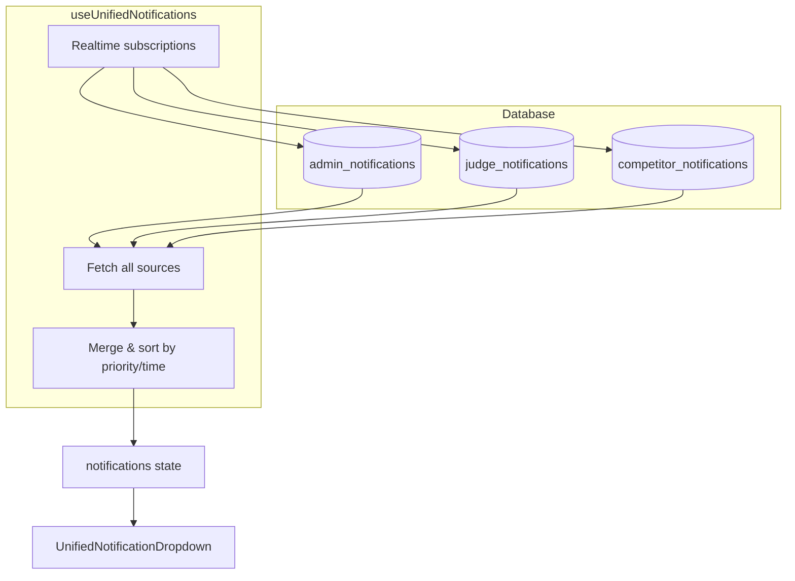

### Notification Sources

| Source | Table | Audience | Example |
|--------|-------|----------|---------|
| Admin | `admin_notifications` | Global admins | System alerts, financial milestones |
| Judge | `judge_notifications` | Judges | Assignment notifications, ballot reminders |
| Competitor | `competitor_notifications` | Registered participants | Pairing releases, schedule changes |

### Data Structure

```typescript
interface UnifiedNotification {
  id: string;
  title: string;
  message: string;
  type: string;
  is_read: boolean;
  created_at: string;
  source: 'admin' | 'judge' | 'competitor';
  priority?: 'low' | 'medium' | 'high' | 'urgent';
  action_url?: string;
  action_text?: string;
  pairing_id?: string;
  tournament_id?: string;
}
```

---

## 6. Admin Access & Scope

### Permission Hierarchy

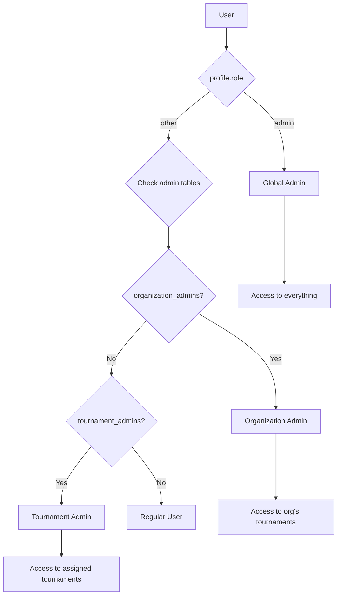

### Admin Route Structure

```mermaid
flowchart TD
    subgraph AdminDashboard[/admin/*]
        Index[/admin - Dashboard]
        
        subgraph AllAdmins[All Admin Types]
            Tournaments[/admin/tournaments]
            Payments[/admin/payments]
            PaymentLinks[/admin/payment-links]
            Applications[/admin/applications]
            Judges[/admin/judges]
            Emails[/admin/emails]
            Notifications[/admin/notifications]
        end
        
        subgraph GlobalOnly[Global Admin Only]
            Users[/admin/users]
            Roles[/admin/roles]
            Promos[/admin/promos]
            Staff[/admin/staff]
            Blog[/admin/blog]
            Site[/admin/site]
            Footer[/admin/footer]
            Sponsors[/admin/sponsors]
            Security[/admin/security]
            Results[/admin/results]
            Orgs[/admin/organizations]
            Performance[/admin/performance]
            Heatmap[/admin/heatmap]
        end
    end
```

---

## 7. Telemetry Flow

### Web Vitals Collection

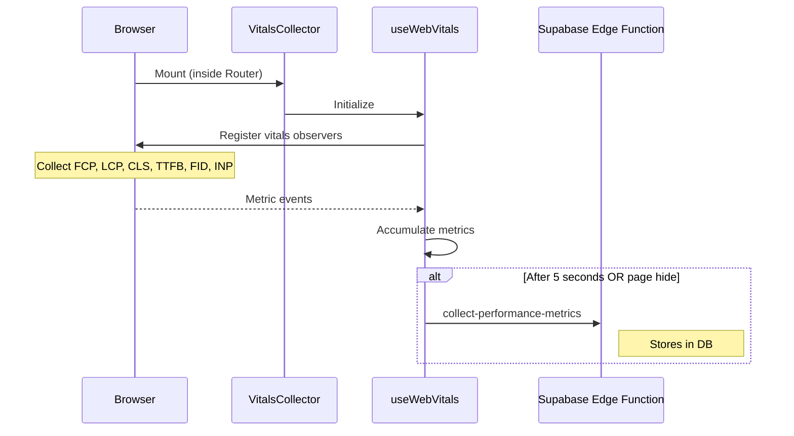

### Interaction Logging

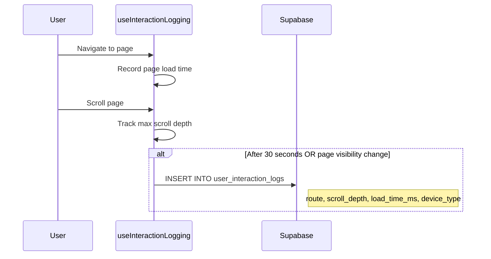

---

## 8. Tournament Chat Flow

### Current Implementation (Dual)

There are currently two chat implementations:

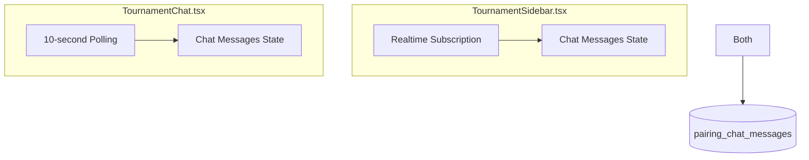

**Note:** This duplication is identified as a technical debt item. See conventions document for recommended approach.

### Message Storage

Tournament chat uses the `pairing_chat_messages` table with a `message_type` discriminator:

```typescript
// Tournament-wide chat message
{
  message: string,
  sender_id: string,
  message_type: 'tournament_chat',
  metadata: { tournament_id: string }
}

// Pairing-specific chat message
{
  message: string,
  sender_id: string,
  message_type: 'pairing_chat',
  pairing_id: string
}
```

---

## Summary: Data Sources & Caching Strategy

| Data Type | Source | Cache Strategy | Realtime? |
|-----------|--------|----------------|-----------|
| Auth/Profile | Supabase Auth + DB | 10 min stale time | No (refresh on demand) |
| Tournament list | `tournaments` table | 5 min stale time | No |
| Single tournament | `tournaments` table | 5 min stale time | Optional |
| Rounds | `rounds` table | 2 min stale time | Yes |
| Pairings | `pairings` table | 1 min stale time | Yes |
| Notifications | Multiple tables | 2 min stale time | Yes |
| Chat messages | `pairing_chat_messages` | No cache (realtime) | Yes |
| Ballots | `ballots` table | No standard cache | No |

